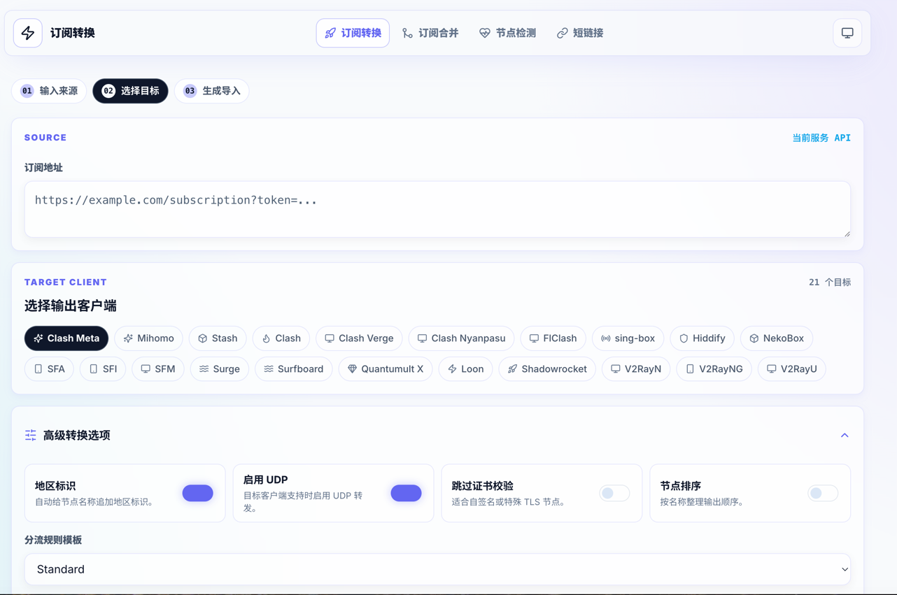
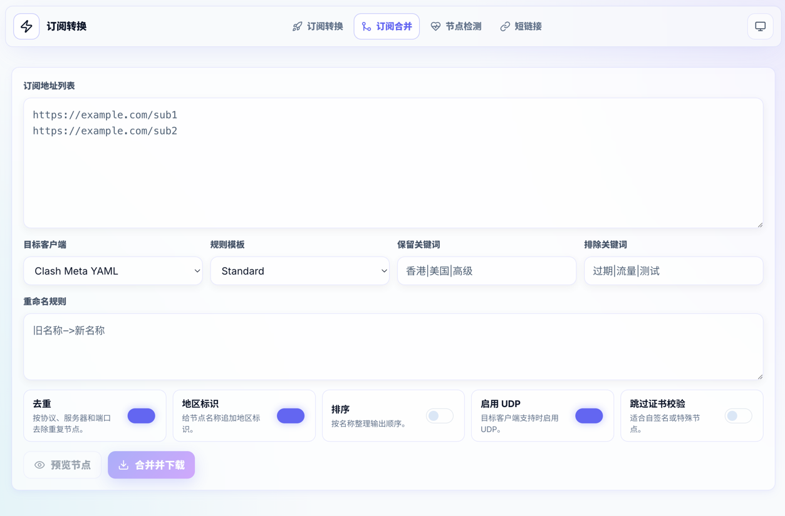
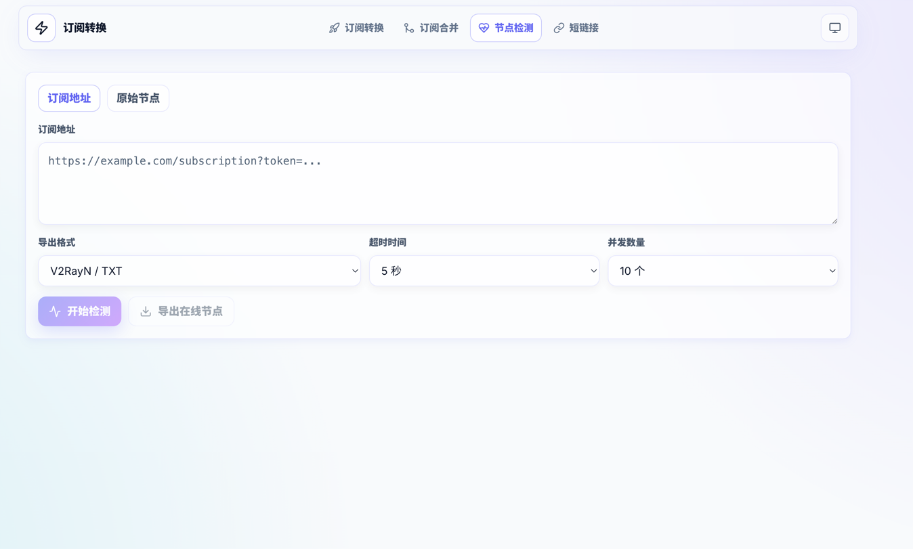
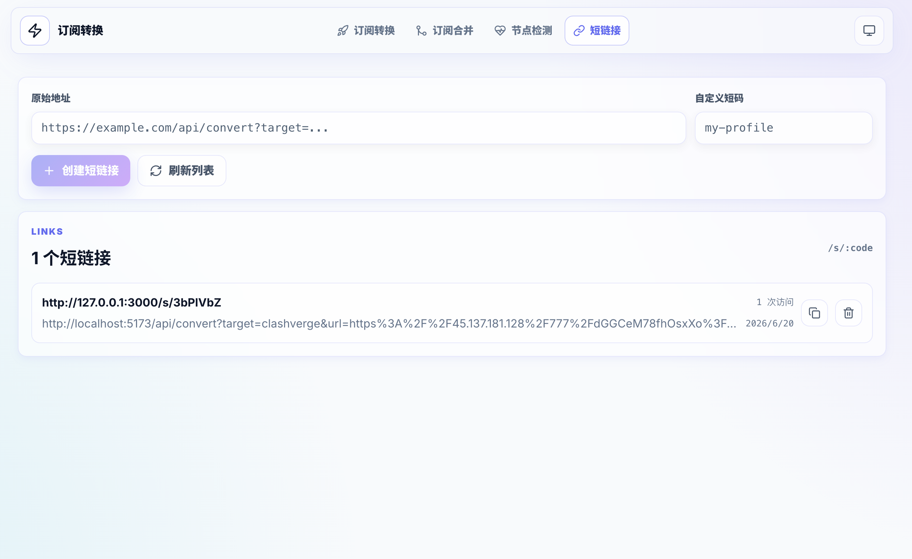

# 订阅转换 (Sub Converter)

> **🎉 鸣谢与声明**：本项目基于原作者的优秀开源项目 [tony-wang1990/laowang-sub-converter](https://github.com/tony-wang1990/laowang-sub-converter) 进行二次开发与前端界面的极致美化重构。特此对原作者的辛勤付出表示衷心感谢！

一个高度现代化、可私有化部署的订阅转换和节点整理工具。前端提供极具质感的极简控制台 UI，后端提供转换、合并、健康检测、短链接和目标客户端导出 API。


## 界面展示

| 订阅转换 | 订阅合并 |
| :---: | :---: |
|  |  |
| **节点检测** | **短链接** |
|  |  |

## 核心功能

- **订阅转换**：把订阅地址转换成 Clash、Mihomo、Surge、Loon、Quantumult X、Shadowrocket、V2RayN、sing-box 等客户端格式。
- **订阅合并**：批量拉取多个订阅，支持去重、排序、地区标识、关键词过滤和重命名。
- **节点检测**：从服务器侧检测节点 TCP 连通性，一键剔除无效节点并导出在线节点。
- **短链接**：把长订阅地址生成固定短码，支持生成时自动缩短，并提供访问统计和管理功能。
- **二维码解析**：转换结果可直接生成订阅二维码，分享链接目标可生成单节点二维码。
- **黑白双生主题**：提供专业级暗黑模式与极致清爽明亮模式，跟随系统自动无缝切换。
- **Docker 部署**：提供 GHCR 多架构镜像和服务器一键脚本。

## 支持范围

输入协议：

```text
SS, SSR, VMess, VLESS, VLESS Reality, Trojan, Hysteria, Hysteria2,
TUIC, Snell, AnyTLS, HTTP, SOCKS5, Clash/Mihomo YAML, sing-box JSON
```

输出目标：

```text
Clash, Clash Meta, Mihomo, Stash, Clash Verge, FlClash,
Surge, Surfboard, Loon, Quantumult X, Shadowrocket,
V2RayN, V2RayNG, V2RayU, NekoBox, Hiddify, sing-box, SFA, SFI, SFM
```

转换器使用统一兼容矩阵，只输出目标客户端可识别的协议。Mihomo、Stash、Surge、Surfboard 和 sing-box 使用各自字段格式；分享链接目标也会过滤不支持的协议。如果没有兼容节点，接口返回 `422`。

完整功能以 Node/Docker 部署为准。仓库不再提供只有部分 API 可用的静态 Serverless 部署配置。

## 服务器一键部署

推荐在 Ubuntu、Debian、CentOS 等 Linux 服务器上执行：

```bash
curl -fsSL "https://raw.githubusercontent.com/xingfeng7788/sub-converter/main/scripts/deploy.sh?$(date +%s)" | sudo bash
```

默认参数：

```text
镜像：qq510023514/sub-converter:latest
安装目录：/opt/sub-converter
数据目录：/opt/sub-converter/data
访问端口：3000
访问地址：http://服务器IP:3000
```

指定端口：

```bash
curl -fsSL "https://raw.githubusercontent.com/xingfeng7788/sub-converter/main/scripts/deploy.sh?$(date +%s)" | sudo env PORT=8080 bash
```

更新到最新镜像：

```bash
curl -fsSL "https://raw.githubusercontent.com/xingfeng7788/sub-converter/main/scripts/deploy.sh?$(date +%s)" | sudo bash -s update
```

查看状态：

```bash
curl -fsSL "https://raw.githubusercontent.com/xingfeng7788/sub-converter/main/scripts/deploy.sh?$(date +%s)" | sudo bash -s status
```

查看日志：

```bash
curl -fsSL "https://raw.githubusercontent.com/xingfeng7788/sub-converter/main/scripts/deploy.sh?$(date +%s)" | sudo bash -s logs
```

卸载容器，保留数据目录：

```bash
curl -fsSL "https://raw.githubusercontent.com/xingfeng7788/sub-converter/main/scripts/deploy.sh?$(date +%s)" | sudo bash -s uninstall
```

如果需要允许服务端拉取本机或内网订阅地址：

```bash
curl -fsSL "https://raw.githubusercontent.com/xingfeng7788/sub-converter/main/scripts/deploy.sh?$(date +%s)" | sudo env ALLOW_PRIVATE_SUBSCRIPTION_URLS=1 bash
```

使用 HTTPS 域名反向代理时，可固定短链接公网地址：

```bash
curl -fsSL "https://raw.githubusercontent.com/xingfeng7788/sub-converter/main/scripts/deploy.sh?$(date +%s)" |
  sudo env PUBLIC_BASE_URL=https://sub.example.com bash
```

脚本会把数据目录修正为容器 UID/GID `10001:10001`，自动修复旧版本因 root 所有权导致的 `Failed to list short links`。

## 手动 Docker 部署

```bash
sudo install -d -m 750 -o 10001 -g 10001 /opt/sub-converter/data

docker run -d \
  --name sub-converter \
  -p 3000:3000 \
  -e DATA_DIR=/app/data \
  -v /opt/sub-converter/data:/app/data \
  --restart unless-stopped \
  qq510023514/sub-converter:latest
```

Docker Compose：

```yaml
services:
  sub-converter:
    image: qq510023514/sub-converter:latest
    container_name: sub-converter
    environment:
      NODE_ENV: production
      PORT: 3000
      DATA_DIR: /app/data
    ports:
      - "3000:3000"
    volumes:
      - sub-converter-data:/app/data
    restart: unless-stopped
    read_only: true
    tmpfs:
      - /tmp
    security_opt:
      - no-new-privileges:true

volumes:
  sub-converter-data:
```

## 环境变量

| 变量 | 默认值 | 说明 |
| --- | --- | --- |
| `PORT` | `3000` | 服务监听端口 |
| `DATA_DIR` | `./data` 或 `/app/data` | 短链接数据目录 |
| `ALLOW_PRIVATE_SUBSCRIPTION_URLS` | `0` | 是否允许后端拉取 localhost、内网 IP、`.local` 等私有订阅地址 |
| `PUBLIC_BASE_URL` | 空 | 反向代理后的公网地址，例如 `https://sub.example.com` |
| `TRUST_PROXY` | `1` | Express 信任的反向代理跳数或规则 |

默认禁止私有地址是为了降低公开部署时的 SSRF 风险。仅在自用内网部署并明确需要时开启。

## 本地开发

要求 Node.js `>=20.19.0`。

```bash
npm install
npm run dev
```

单独启动后端：

```bash
npm run server
```

生产构建：

```bash
npm run build
npm run server
```

## API

订阅转换：

```http
GET /api/convert?target=clashmeta&url=https%3A%2F%2Fexample.com%2Fsub
```

常用参数：

| 参数 | 说明 |
| --- | --- |
| `target` | 目标客户端，如 `mihomo`、`singbox`、`surge`、`v2rayn` |
| `url` | 订阅地址，需要 URL 编码 |
| `emoji` | 是否追加地区标识，`1` 或 `0` |
| `udp` | 是否启用 UDP，`1` 或 `0` |
| `scert` | 是否跳过证书校验，`1` 或 `0` |
| `sort` | 是否按名称排序，`1` 或 `0` |
| `include` | 仅保留包含关键词的节点，多个关键词用 `|` 分隔 |
| `exclude` | 排除包含关键词的节点，多个关键词用 `|` 分隔 |
| `rename` | 重命名规则，如 `old->new` |
| `rulePreset` | 分流模板：`standard`、`developer`、`gaming`、`streaming` |

订阅合并：

```http
POST /api/merge
Content-Type: application/json

{
  "urls": ["https://example.com/sub1", "https://example.com/sub2"],
  "target": "clashmeta",
  "dedupe": true,
  "emoji": true,
  "sort": false,
  "rulePreset": "standard"
}
```

合并预览：

```http
POST /api/merge/preview
```

节点健康检测：

```http
POST /api/health/check
Content-Type: application/json

{
  "url": "https://example.com/sub",
  "timeout": 5000,
  "concurrent": 10,
  "exportTarget": "v2rayn"
}
```

也可以直接传原始节点内容：

```json
{
  "content": "ss://...\nvmess://...",
  "exportTarget": "clashmeta"
}
```

短链接：

```http
POST /api/shortlink
Content-Type: application/json

{
  "url": "https://example.com/api/convert?target=clashmeta&url=...",
  "code": "my-profile"
}
```

其他接口：

```http
GET /api/shortlink/list
DELETE /api/shortlink/:id
GET /api/targets
GET /healthz
```

## 测试和审计

```bash
npm test
npm run build
npm run audit
```

当前测试覆盖 21 个目标客户端兼容矩阵、协议解析、订阅转换、合并、去重、健康检测、短链接完整生命周期、HTTPS 反代地址、部署权限和未知 API 路由。发布前还使用官方 Mihomo 与 sing-box 内核检查生成配置。

## 镜像发布

推送到 `main` 后，GitHub Actions 会构建并发布：

```text
qq510023514/sub-converter:latest
qq510023514/sub-converter:main
qq510023514/sub-converter:sha-xxxxxxx
```

支持 `linux/amd64` 和 `linux/arm64`。

## License

MIT
